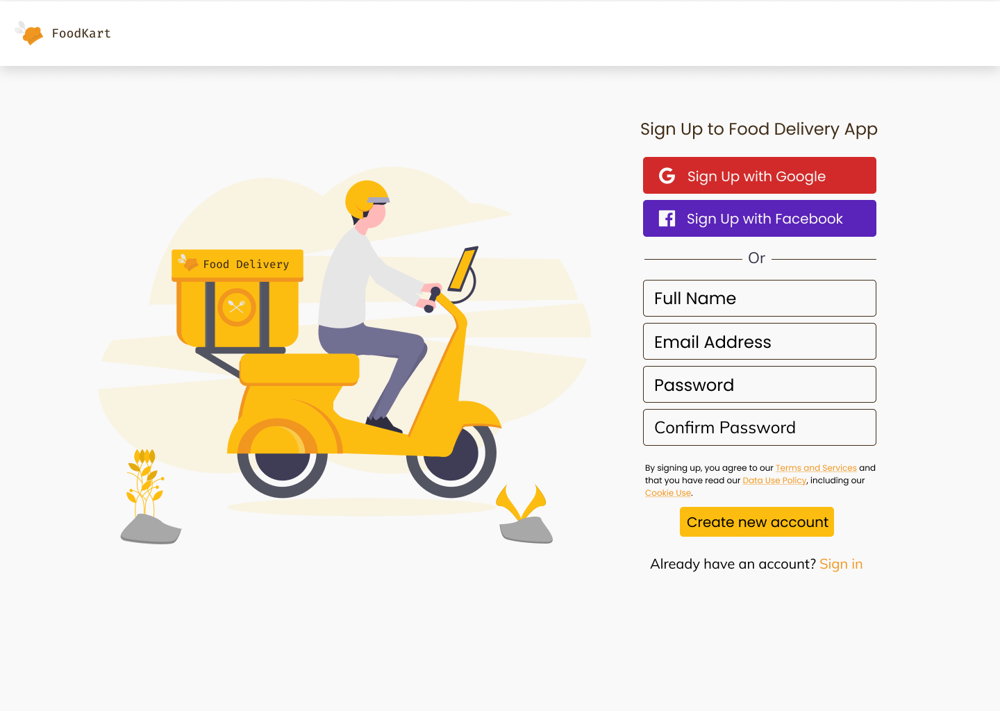

<h1 align="center" style="border-bottom: none !important; margin-bottom: 5px !important;"><a href="https://niikkiin.github.io/foodKart/">FoodKart</a></h1>

  

An open-source Food Delivery Services Application using MERN Stack.

  

 

### Date Started

* July 01, 2020

### Prerequisites

Before you continue, ensure you have met the following requirements:

* You have installed the Node.js

 

### Quick Start

* Install dependencies by running `yarn` or `npm install`.
* Run `yarn start` or `npm run start` to start the local development server.
* 😎 **That's it!** You're ready to start using FoodKart.

 

### Project Structure

- This project is bootstrapped using [Create React App](https://github.com/facebook/create-react-app).
- Template used is [Shards Admin React Template](https://designrevision.com/downloads/shards-dashboard-lite-react/).
- **Flux** is used for state management and all Flux specific files are located inside `src/flux`. Transitioning to a more robust solution such as Redux is also fairly simple.
- All primary templates are located inside `src/views`.
- 
- The `src/components` directory hosts all template-specific subcomponents in their own subdirectory.
- The layout styles inherited from Shards Dashboard are pulled in from the `src/shards-styles` submodule inside `src/App.js`.
- Other extra styles specific to the libraries used are located inside `src/assets`.
- The `src/utils` directory contains generic Chart.js utilities.

 

### Styling

* All custom styles will be placed on `src/shards-styles/scss/_overrides.scss`.
* Place new styles for a component inside `src/shards-styles/scss/components` and import to `src/shards-styles/scss/main.scss`.
* All svg files and images should be placed on `src/assets` and to its corresponding category.

### Available Scripts

### `npm start`

Runs the app in the development mode.

### `npm test`

Launches the test runner in the interactive watch mode.

### `npm run build`

Builds the app for production to the `build` folder.

### `npm run eject`

**Note: this is a one-way operation. Once you `eject`, you can’t go back!**

If you aren’t satisfied with the build tool and configuration choices, you can `eject` at any time. This command will remove the single build dependency from your project.

 

### Built using

- [Shards React](https://github.com/designrevision/shards-react)
- [Chart.js](https://www.chartjs.org/)
- [Flux](https://facebook.github.io/flux/)
- [No UI Slider](https://refreshless.com/nouislider/)
- [React Datepicker](https://www.npmjs.com/package/react-datepicker)
- [Quill](https://quilljs.com/)

 

### Changelog

Please check out the [CHANGELOG](CHANGELOG.md).
